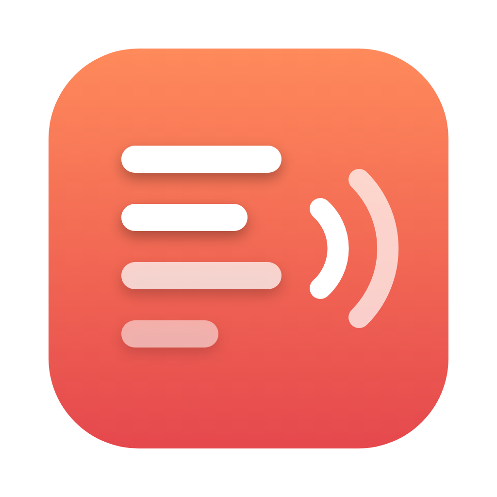
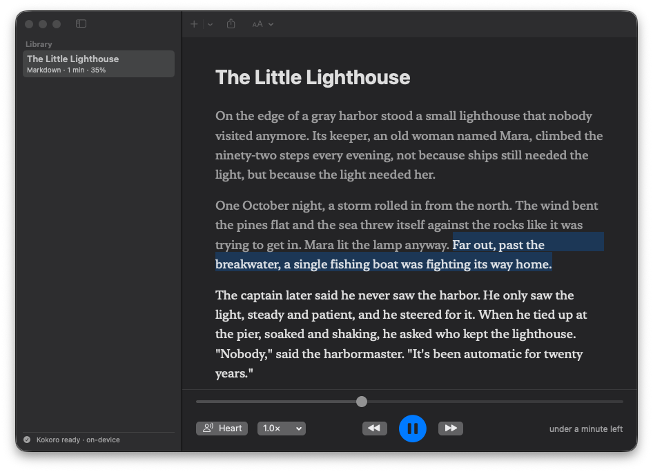

<p align="center">
  
</p>

<h1 align="center">Aloud</h1>

<p align="center">
  Have anything read to you in a natural voice. PDFs, EPUBs, articles, your own notes. Runs entirely on your Mac.
</p>

<p align="center">
  <a href="https://github.com/Dunebru/aloud/releases/latest"></a>
  <a href="https://github.com/Dunebru/aloud/releases"></a>
  
  
  <a href="LICENSE"></a>
</p>

<p align="center">
  <a href="https://github.com/Dunebru/aloud/releases/latest"></a>
</p>

Aloud does what Speechify charges $139 a year for. It uses Kokoro, an open 82-million-parameter speech model that runs on the Neural Engine, so the voice is natural, it starts instantly, and nothing you read ever leaves your computer.

<details>
<summary>Table of contents</summary>

- [Features](#features)
- [Install](#install)
- [Usage](#usage)
- [Voices](#voices)
- [FAQ](#faq)
- [Build from source](#build-from-source)
- [License](#license)
- [Acknowledgements](#acknowledgements)

</details>

## Features

- **Reads anything** - PDF, EPUB, Word, Markdown, plain text, RTF, HTML, any article by URL, or text you paste
- **Natural voices** - 54 American and British voices from Kokoro-82M, synthesized on your Mac's Neural Engine, about 15x faster than real time
- **Follow along** - the sentence being spoken is highlighted and kept in view. Click any sentence to jump there
- **Speed** - 0.5x to 3x without the chipmunk effect, the model re-times the speech
- **Library** - everything you add is kept, with your reading position, so you can pick up where you left off
- **Export** - turn a whole document into an M4A audiobook
- **Private** - no account, no upload, no telemetry. The voice model downloads once (about 90 MB) and then works offline

## Install

Download **Aloud.zip** from the [latest release](https://github.com/Dunebru/aloud/releases/latest), unzip, and move **Aloud.app** to Applications.

The app is not notarized. First launch: **right-click → Open → Open**. If macOS still refuses:

```bash
xattr -dr com.apple.quarantine /Applications/Aloud.app
```

Requires macOS 14 Sonoma or newer on Apple silicon (M1 or later).

On first launch Aloud downloads the Kokoro voice model from Hugging Face (about 90 MB). After that it runs offline.

## Usage

1. Drop a file on the window, press **Add**, or paste a web address (⌘L) or text (⇧⌘V).
2. Press **Play**, or click any sentence to start from there.
3. Change voice and speed from the bar at the bottom. Space plays and pauses, arrow keys skip sentences, `[` and `]` change speed.
4. **Export Audio** in the toolbar saves the document as an audiobook.

## Voices

Kokoro ships 54 English voices. A few good ones to try:

| Voice | Style |
|---|---|
| Heart (default) | American female, warm |
| Bella | American female, bright |
| Michael | American male, clear |
| George | British male, measured |
| Emma | British female, soft |

Preview any voice from the voice menu.

## FAQ

**Why does the first sentence take a second?**
The Neural Engine compiles the model on first use of a session. After that, sentences are synthesized a few ahead of playback, so there are no pauses.

**Does it support other languages?**
Not yet. Kokoro has Mandarin and Japanese variants; support is on the list.

**Can it read scanned PDFs?**
Not unless they have a text layer. Run them through OCR first (Preview does this on macOS 26).

**How does this compare to the built-in macOS speech?**
macOS voices are fine for alerts. Kokoro sounds like a person reading to you.

## Build from source

```bash
git clone https://github.com/Dunebru/aloud.git && cd aloud
swift test
scripts/build-app.sh      # dist/Aloud.app and dist/Aloud.zip
```

Aloud is a Swift package with one dependency, [FluidAudio](https://github.com/FluidInference/FluidAudio) (Apache 2.0), vendored under `Vendor/` so builds are reproducible. `scripts/build-app.sh` fetches the 50 MB text-normalization framework it links against on first run.

## License

[MIT](LICENSE) © dunebru

## Acknowledgements

- [Kokoro-82M](https://huggingface.co/hexgrad/Kokoro-82M) by hexgrad, Apache 2.0
- [FluidAudio](https://github.com/FluidInference/FluidAudio) for the Neural Engine port
